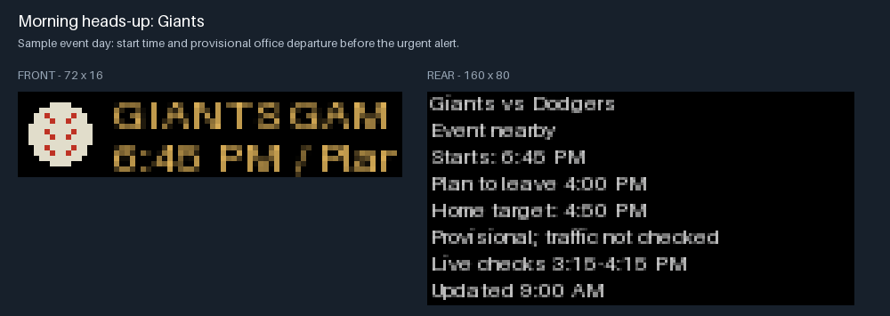
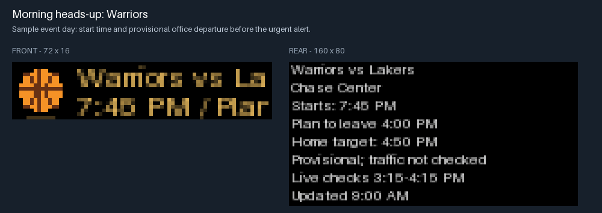

# Commute Bar

Commute Bar turns a BUSY Bar into an event-aware departure assistant. It watches San Francisco Giants games, Chase Center events, Moscone conventions, and SFMTA driving advisories, then explains what may affect the commute and when to leave the office.



The project has two complementary parts:

- A Python service fetches public event data, plans alerts, renders the standard BUSY display payload, and can run locally or on Google Cloud Run.
- An optional firmware app called **Upcoming Events** stores up to 20 events on the bar. Turn the wheel to browse, press OK for details, and press Back to return. The cloud publisher alternates two validated cache files so an interrupted update leaves the previous schedule available.

The public example is intentionally location-neutral. Your office, destination, schedule, API credentials, cloud project identifiers, generated caches, and firmware builds stay outside source control.

## What it shows

| Situation | Front display | Rear display |
| --- | --- | --- |
| Event day, before departure | Animated event icon and matchup or event name | Start time and a provisional office departure |
| Actionable commute warning | **GO HOME** with the relevant icon | Departure time, arrival target, cause, and data freshness |
| Live traffic unavailable | **CHECK MAPS** | Event context and a clear explanation that traffic is unverified |
| Local event browser | Upcoming Events list | Timing, venue, and cached/stale status |



The icon set includes baseball, basketball, convention, concert, traffic, detour, and lunch animations. Animation runs on the bar while text stays legible. Display examples use simulated data.

## Quick start

Requirements:

- Python 3.10 or newer
- A BUSY Bar for device output; preview generation and tests work without one
- Pillow only if you want to rebuild the design assets

Copy the example configuration, replace the placeholder addresses, and run a one-time refresh:

```sh
cp config.example.json config.local.json
python3 -m commutebar --refresh
```

Open `data/preview.html` to inspect the current plan. To keep it refreshed locally:

```sh
python3 -m commutebar --watch
```

Useful commands:

```sh
python3 -m commutebar --device-test
python3 -m commutebar --at 2026-09-15T15:00
python3 -m unittest discover -s tests -v
```

`--device-test` writes to a BUSY Bar over the documented USB address. Normal `--send` updates respect the configured weekday and commute window.

## Live traffic

Traffic estimates are optional. Set `GOOGLE_MAPS_API_KEY` and explicitly add `--traffic` to a one-time refresh:

```sh
python3 -m commutebar --refresh --traffic
```

This sends the configured origin and destination to Google Routes and may incur charges. Watch mode rejects `--traffic` so an unattended local loop cannot create repeated billable requests. The hosted service includes a fail-closed monthly request reservation mechanism; set a quota and billing alert at the provider too.

## Hosted service

The included Cloud Run entry point keeps the home computer out of the loop. Cloud Scheduler invokes the private `/tick` endpoint, the runtime reads commute settings and the BUSY token from Secret Manager, and event caches remain in a private Cloud Storage bucket.

Install hosted dependencies and review the provisioning script before using it:

```sh
python3 -m pip install -r requirements.txt
python3 deploy/provision.py --project YOUR_GCP_PROJECT_ID
```

Provisioning starts in preview mode. Connect a BUSY Bar-scoped cloud token through Secret Manager and switch `DRY_RUN` only after verifying the project, schedule, and display behavior. Never pass tokens on a command line or commit them to a config file.

## Upcoming Events firmware app

The native app is a source overlay for official BUSY Bar firmware 1.2.4 at commit `b315346d2d0a686c5fada9e972bc688e85bd4137`. It is not a standalone binary and this repository does not distribute compiled firmware.

```sh
git clone --recursive --branch 1.2.4 https://github.com/busy-app/busybar-firmware.git /tmp/busybar-firmware
git -C /tmp/busybar-firmware checkout b315346d2d0a686c5fada9e972bc688e85bd4137
git -C /tmp/busybar-firmware submodule update --init --recursive
python3 native/prepare.py /tmp/busybar-firmware
cd /tmp/busybar-firmware
./fbt TARGET_HW=22 FIRMWARE_ORIGIN=CommuteBar
```

Confirm your bar's hardware target and follow BUSY's official firmware instructions before flashing. A successful build alone does not establish device compatibility. See [native/README.md](native/README.md) for the cache format and interaction model.

> [!WARNING]
> **Open issue (2026-09-14):** flashing a self-built image left the reference device with a working display and USB API but a **non-functional Wi-Fi radio** (`GET /api/wifi/networks` returns `503`). Root cause is not yet confirmed. Read [docs/TROUBLESHOOTING.md](docs/TROUBLESHOOTING.md) before flashing, and always verify Wi-Fi afterward while a known-good network is still in reach.

## Privacy and safety boundaries

- `config.local.json`, `data/`, local tokens, deployment state, and firmware binaries are ignored.
- Native schedule snapshots contain public event facts and provisional advice, never route addresses or credentials.
- Event-only planning is precautionary. It does not promise an arrival time.
- MLB's public schedule endpoint and Chase Center's website service are observed public backends and can change without notice.
- Moscone release times and SFMTA closure hours may require checking the source notice.

## Project status

The Python planner, event adapters, cloud path, alert rendering, priority behavior, A/B native cache, and local event browser have automated coverage. The reference device was tested with firmware 1.2.4 / API 27.5.0. A new installation should still verify its own hardware target, Wi-Fi compatibility, cloud token scope, and alert priority behavior.

## License and attribution

Original code and art in this repository are licensed under GPL-2.0-or-later. The native overlay is designed for the GPL-licensed [BUSY Bar firmware](https://github.com/busy-app/busybar-firmware). Animation conversion uses [busyshow](https://github.com/anoldguy/busyshow), which is not vendored and is available under MIT or Apache-2.0. See [NOTICE.md](NOTICE.md) and the retained license texts in `design/assets/`.

BUSY Bar is a product of its respective owner. This independent project is not an official BUSY release.
